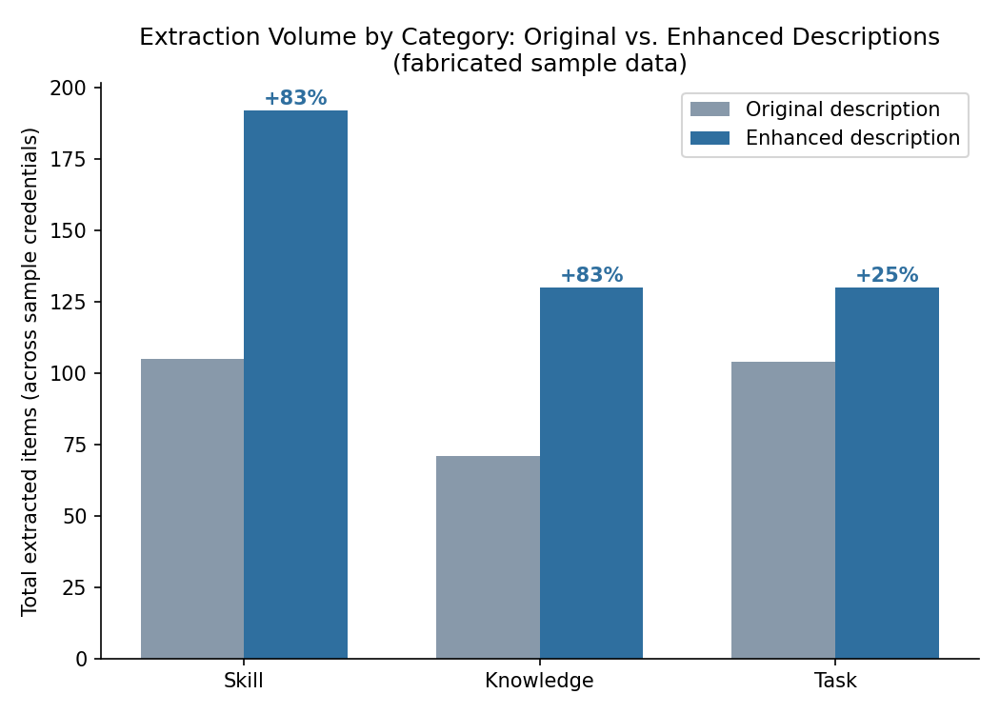
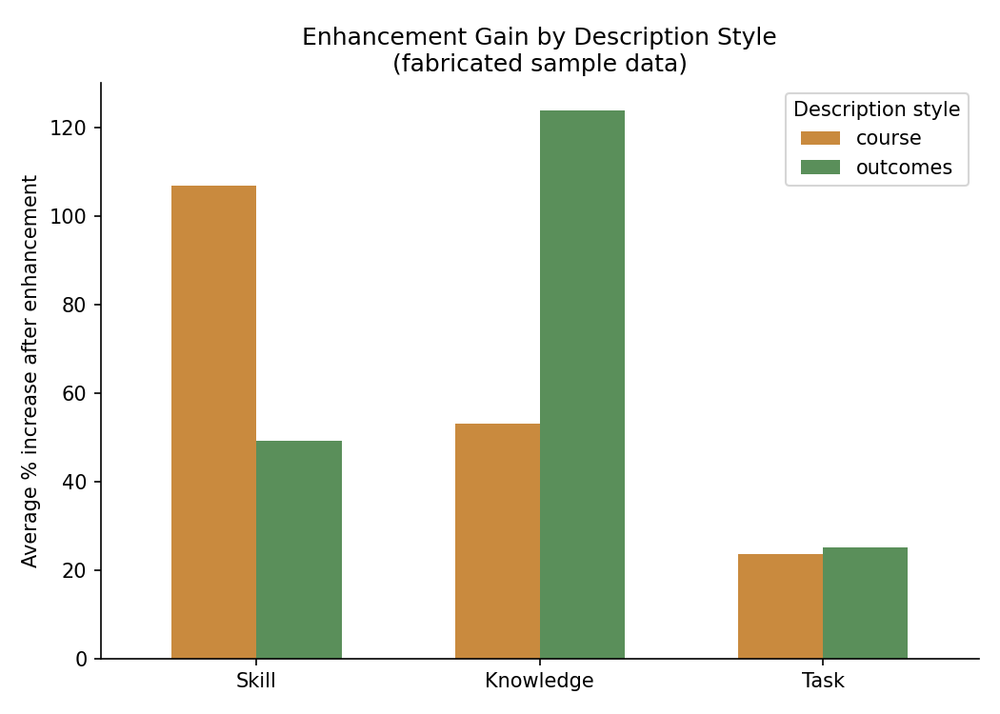

# Evaluating LLM-Based Skills Extraction for Credential-to-Job Alignment

**TL;DR:** Evaluated an LLM-powered skills-extraction pipeline ([LAiSER](https://github.com/LAiSER-Software)) as a response to the traditional CIP→SOC crosswalk used to match educational credentials to occupations. Built the evaluation framework, tuned extraction parameters, and quantified where the model over- or under-performs — producing a data-driven recommendation for whether (or how) to scale the approach.

---

## Problem

Workforce and education organizations traditionally match credentials (namely degrees) to occupations using **CIP→SOC crosswalks** static, government-defined category mappings. These crosswalks are rigid and lack nuance: they say a credential *category* maps to a job *category*, but say nothing about whether the specific skills taught actually align with other roles.

The fundemental quesiton was: **can an LLM-based skills-extraction tool do better, by reading credential and job-posting text directly and comparing extracted skills instead of static codes?**

## Approach

```
Credential text ──┐
                   ├──▶ Exact Phrase Matching ──▶ Semantic Matching 
Job posting text ──┘
```

1. **Extraction** — ran credential descriptions and job/occupation descriptions through LAiSER, which uses an LLM to pull structured skills, knowledge, and task statements out of unstructured text.
2. **Evaluation** — Observing what factors impact different extraction. 
3. **Comparison** — Tested the alignment betwen skills/knowledge/tasks for an individual students job outcomes as compared to their credentials.
## What was actually built
This wasn't just "run the tool" — most of the technical work was in diagnosing and controlling model behavior:

- **Prompt engineering**: modified default extraction prompts to control how many skills/knowledge/task items the model returned per document, after finding the defaults were silently capping output.
- **Similarity threshold tuning**: ESCO-alignment similarity thresholds are set independently per category (skill / knowledge / task). I ran a diagnostic sweep — loosening/tightening one threshold at a time while holding the others constant — to isolate *which* category was the bottleneck on extraction coverage, rather than tuning all three blindly.
- **Input sensitivity testing**: compared extraction output between original credential descriptions and "enhanced" (more detailed) descriptions, segmented by credential type, description style (course-focused vs. outcomes-focused), and issuing institution, to characterize what kind of input text the model handles well vs. poorly.
- **Quality vs. coverage tradeoff analysis**: distinguished "the model found more skills" from "the model found more *correct* skills" — flagged cases where loosening thresholds increased volume but let in low-confidence taxonomy matches.

## Key findings

*(Figures and the sample dataset below are fabricated/generalized to illustrate the same patterns found in the real analysis, without using proprietary CredLens/Lightcast data — see note at bottom.)*



- Extraction volume is highly sensitive to **input description style**: outcomes-focused text ("students will understand X") disproportionately boosts *knowledge*-type extractions, while course-style text boosts *skill* and *task* extractions.



- **Task extraction was the least sensitive** to input enhancement — task-relevant language appears to already be present even in sparse credential descriptions, unlike skills and knowledge.
- More detailed input text reliably improved coverage against the taxonomy (i.e., unlocked previously-missed skill concepts), but gains were uneven across categories — meaning "write better descriptions" is not a uniform fix.
- A small number of credentials produced *anomalous* results under enhancement (extraction counts went down, not up) — these were flagged as data-quality issues (e.g., duplicate records) rather than genuine model failures, which mattered for not over- or under-crediting the tool.
- Where LAiSER's skills-based alignment disagreed with the CIP→SOC crosswalk, disagreements clustered around credentials with vague or generic descriptions — suggesting the method's value is highly dependent on input text quality, not just model capability.

See [`data/sample_extraction_output.csv`](data/sample_extraction_output.csv) for the underlying (fabricated) sample data and [`generate_assets.py`](generate_assets.py) for the analysis/plotting code.

## Deliverable

Findings were synthesized into a two-page executive summary for non-technical stakeholders, recommending whether/how to scale this approach into a larger initiative — prioritizing a clear narrative and visualization over exhaustive technical detail, since the audience was making a resourcing decision, not reviewing methodology.

## Stack

`Python` · LLM-based extraction (LAiSER) · pandas for comparative analysis · prompt engineering / parameter tuning · Lightcast

## Limitations & open questions

- Extraction quality is bottlenecked by input text quality — the model can't extract signal that isn't in the description.
- There's an apparent ceiling effect on extraction volume regardless of input enhancement, worth flagging as a model constraint rather than a data problem.
- Institution-level writing style may systematically bias extraction profiles — not fully isolated in this pass.

---
*Note: this repository presents a generalized version of an internal evaluation conducted for an education-workforce organization. Proprietary credential/job data and exact figures have been abstracted or replaced with representative examples to respect data confidentiality.*
